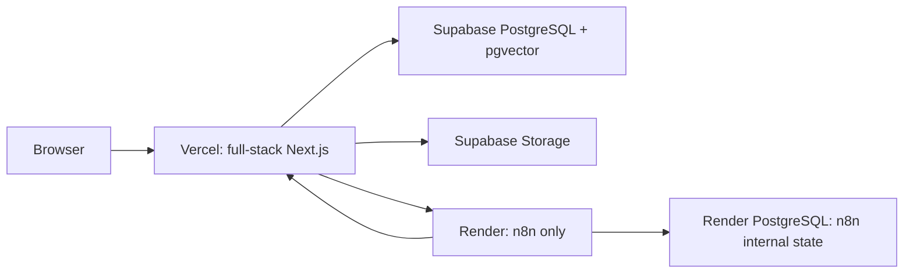

# ZENTRA deployment runbook

This is the canonical deployment guide for the current full-stack Next.js application.

## Target architecture



- Vercel serves the pages and Next.js Route Handlers. There is no second copy of the
  application API on Render.
- Supabase is the source of truth for application data, vector search, and files.
- Render runs n8n and a separate Render PostgreSQL database containing only n8n's
  workflows, credentials, and execution state.
- Secrets remain server-side. No service-role, Gemini, database, or orchestration secret
  may use a `NEXT_PUBLIC_` prefix.

This layout avoids split traffic, duplicate scheduled work, cache inconsistency, and n8n
having direct access to application tables.

## Environment separation

| Environment | Next.js | Application database/storage | n8n automation |
|---|---|---|---|
| Local | `npm run dev` | Local PostgreSQL or isolated Supabase dev project | Local n8n |
| Preview/staging | Vercel Preview with a stable staging alias | Supabase branch or separate staging project | Disabled by default; isolated n8n only if explicitly enabled |
| Production | Vercel Production/custom domain | Supabase `ZenTra` production project | Render `zentra-n8n` |

Never point an arbitrary pull-request preview at production data. Until an isolated
Supabase branch/project exists, set `N8N_WEBHOOK_ENABLED=false` in Vercel Preview and do
not add production database credentials to Preview.

## 1. Supabase production setup

The selected production project is:

- Name: `ZenTra`
- Project reference: `ltuvwwjevpyeawrtjahs`
- Region: Seoul (`ap-northeast-2`)
- PostgreSQL: 17

The six buckets in `supabase/storage-buckets.sql` are idempotent and are already applied
to this project:

| Bucket | Access | Limit | Purpose |
|---|---:|---:|---|
| `payment-proofs` | Private | 4 MB | Receipts and proof documents |
| `testimony-photos` | Public | 4 MB | Approved public testimony photos |
| `profile-media` | Public | 2 MB | Admin/client avatars |
| `command-center-drafts` | Private | 15 MB | Draft Gallery/Facility images |
| `assistant-source-documents` | Private | 25 MB | PDF/DOCX knowledge sources |
| `public-content-media` | Public | 15 MB | Immutable published media |

Public buckets permit public reads, not public writes. All writes go through validated
server code using `SUPABASE_SECRET_KEY`. Private previews use signed URLs. Large Command
Center files upload directly to a signed Supabase URL, avoiding Vercel's request-size
limit, and are validated again before use.

### Obtain protected connection values

In Supabase Dashboard, open **Connect** and copy both connection strings:

1. Transaction pooler, port `6543` -> `DATABASE_URL` for Vercel runtime.
2. Session pooler/direct connection, port `5432` -> `DIRECT_URL` only for a trusted
   migration workstation or protected CI environment.

URL-encode special characters in the database password. Do not commit either value.
Store the direct URL outside Vercel unless a trusted migration job specifically needs it.

In **Project Settings > API Keys**, create/copy a modern `sb_secret_...` key and store it
as `SUPABASE_SECRET_KEY`. The legacy service-role key remains supported only for
transition. The project URL is `https://ltuvwwjevpyeawrtjahs.supabase.co`.

### Apply the Prisma schema

Prisma migrations are the only authority for application schema history. Do not paste
individual Prisma migration files into the Supabase SQL editor.

Create an ignored `.env.production.local` from `.env.example`, containing the protected
production values. This file is covered by `.gitignore`. Then run:

```powershell
npm ci
npm.cmd run db:production:check
npm.cmd run db:production:status
npm.cmd run db:production:deploy
npm.cmd run db:production:seed
```

The Command Center migration enables `pgvector`; deployment fails deliberately if it is
not available. The final security migration enables RLS on every application table and
revokes Data API table/sequence access from Supabase `anon` and `authenticated`. The
server-side Prisma database owner still accesses the data. Future migrations that add
tables must also enable RLS before release.

Save the one-time Super Admin password securely, sign in, and rotate it. Then remove the
seed password from the operator environment.

## 2. Vercel setup

1. Import the Git repository into Vercel as a Next.js project.
2. Keep the repository root as the Root Directory.
3. Use `npm run build`; `postinstall` already runs `prisma generate`.
4. Keep the production function region at Seoul (`icn1`) through `vercel.json`, close to
   Supabase.
5. Add the Production variables from `.env.example`. Use the Supabase transaction
   pooler URL for `DATABASE_URL`. Do not run `prisma migrate deploy` during `next build`.
6. Set `NEXTAUTH_URL` to the final HTTPS application origin, with no trailing path.
7. Run `npm.cmd run env:check:production:file` after Render webhook/scanner/email values
   are available and before enabling production traffic. An initial private deployment
   may keep `N8N_WEBHOOK_ENABLED=false` while Render is being provisioned.

Use separate values in Vercel's Preview environment:

- a staging `DATABASE_URL` and Supabase URL/key/buckets;
- a stable HTTPS staging alias for `NEXTAUTH_URL` when testing authentication;
- `DEPLOYMENT_ENV=preview`;
- `N8N_WEBHOOK_ENABLED=false`;
- no `CLIENT_ACCESS_DEV_CODE` outside local development.

Generic PR previews can render UI without automation. Authentication and mutation QA
should use a stable staging alias connected to isolated data.

After deployment, verify:

```text
GET https://YOUR_DOMAIN/api/health
```

The response must report `ready: true`, database connectivity, pgvector, auth, storage,
and orchestration configuration. It never returns credential values.

## 3. Render n8n setup

The repository root contains `render.yaml`. During development, it provisions:

- one free n8n web service in Singapore;
- one private free Render PostgreSQL database for n8n state;
- n8n pinned to `2.28.1`;
- health checks, execution pruning, timezone, encryption, and generated DB credentials.

In Render, choose **New > Blueprint**, connect this repository, confirm that both
resources use the Free plan, and deploy. This is a temporary development environment:
the web service sleeps when idle and free Render PostgreSQL expires after 30 days, so it
cannot run the one-minute Command Center scheduler reliably. Export workflows and
credentials before the database expires. Before production, change the web service to
`standard`, change PostgreSQL to `basic-256mb`, restore `diskSizeGB: 5`, and review the
current Render pricing before deploying the upgrade.

Supply every `sync: false` value in the Blueprint form:

| Render variable | Value |
|---|---|
| `WEBHOOK_URL` | `https://YOUR_N8N_SERVICE.onrender.com/` |
| `N8N_EDITOR_BASE_URL` | Same n8n origin |
| `ZION_BACKEND_URL` | Production Vercel/custom-domain origin |
| `BACKEND_ORCHESTRATION_SECRET` | Same random value as Vercel |
| `N8N_WEBHOOK_SECRET` | Same random value as Vercel |
| `BOOKING_ORCHESTRATION_API_KEY` | Same protected API key as Vercel |
| `ZION_EMAIL_FROM` | Verified sender address |
| Support variables | Approved business contact values |

Do not change `N8N_ENCRYPTION_KEY` after n8n stores credentials. Losing it makes saved
credentials unreadable. Export workflows before every n8n upgrade and test the pinned
target version locally first.

Import and activate the reviewed workflow JSON files from `docs/n8n/`, including:

- `zion-new-booking-orchestration.workflow.json`
- `zentra-command-center-worker.workflow.json`

Configure email credentials inside n8n's credential store. Never place Supabase,
database, or Gemini credentials in n8n. The worker calls protected application endpoints
with safe job IDs and metadata only.

Once the Render hostname and production workflows exist, set the resulting n8n webhook
URLs in Vercel Production and redeploy. Confirm `https://YOUR_N8N_SERVICE.onrender.com/healthz`
before enabling `N8N_WEBHOOK_ENABLED=true`.

## 4. Release order

1. Back up the current local database and any storage metadata.
2. Configure the production Supabase connection locally; run `db:status`, `db:deploy`,
   and `db:seed` once.
3. Add Vercel Production variables and deploy the Next.js application.
4. Verify `/api/health` before allowing traffic.
5. Deploy the Render Blueprint and import n8n workflows.
6. Set n8n webhook URLs in Vercel and redeploy.
7. Run one test booking, one client verification email, one scheduled publication, one
   knowledge indexing job, and one failed-job retry.
8. Add the custom domain and update `NEXTAUTH_URL`, `ZION_BACKEND_URL`, CORS/provider
   callbacks if applicable, and n8n webhook configuration.
9. Rotate any setup-only secrets and remove them from local shell history/files.

## 5. Continuous delivery while developing

- Develop schema changes locally with `npm run db:migrate`.
- Commit every generated Prisma migration; never use `db push` against production.
- Test migrations and seeds against isolated staging before production.
- Run `npm run deploy:verify` before merging.
- Promote the same reviewed commit from Preview to Production.
- Run `npm run db:deploy` as an explicit release step before deploying code that requires
  the new schema. Migrations must be backward compatible during rolling releases.
- Keep Vercel Preview automation off unless Preview has isolated Supabase and n8n.
- Review `/api/health`, Vercel logs, Render health/executions, Supabase database/storage
  logs, failed Command Center jobs, and assistant fallback rate after each release.

Generate independent secrets rather than reusing one value:

```powershell
node -e "console.log(require('crypto').randomBytes(32).toString('base64url'))"
```

Run the command separately for NextAuth, booking API, backend orchestration, n8n webhook,
client-access hashing, and malware-scanner authentication.

## Go-live gates

- `npm run deploy:verify` passes.
- Production environment validation passes.
- Prisma reports no pending migrations.
- `/api/health` and n8n `/healthz` are healthy.
- Storage limits/access match `supabase/storage-buckets.sql`.
- Privacy and Terms have legal approval before publication.
- Production document ingestion has a malware scanner.
- Preview cannot access production data or workflows.
- Super Admin credentials and all setup secrets have been rotated and stored in a
  password manager.
- Supabase security/performance advisors have been reviewed after schema deployment.
