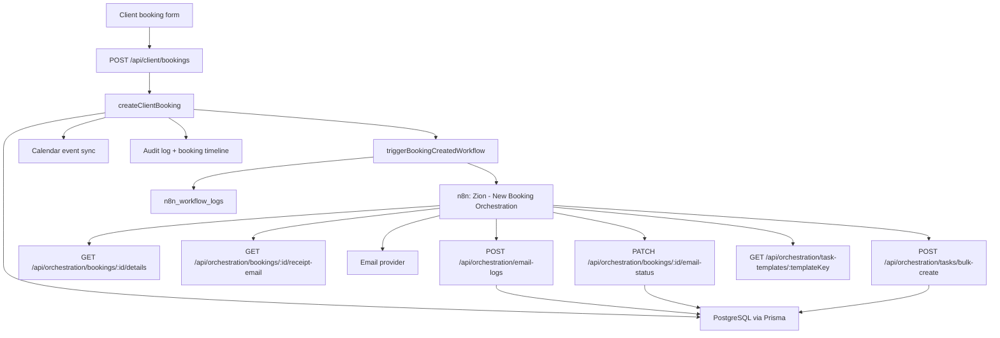

# Zion Current n8n Orchestration Architecture

Last verified from the current codebase: 2026-07-12

Setup note, 2026-07-05: use `docs/n8n/zion-new-booking-orchestration-final.md` and `docs/n8n/zion-new-booking-orchestration.workflow.json` for new setup and import. This file remains an architecture and historical handoff reference.

This document describes the current n8n orchestration architecture and the active step-by-step flow implemented in the Zion Events Place system. It is written as a handoff/reference document, not as a future plan.

Primary source files:

- `app/api/client/bookings/route.ts`
- `services/booking-orchestration/orchestration.service.ts`
- `services/booking-orchestration/receipt-email.ts`
- `app/api/orchestration/bookings/[bookingId]/details/route.ts`
- `app/api/orchestration/bookings/[bookingId]/receipt-email/route.ts`
- `app/api/orchestration/bookings/[bookingId]/email-status/route.ts`
- `app/api/orchestration/email-logs/route.ts`
- `app/api/orchestration/tasks/bulk-create/route.ts`
- `app/api/orchestration/workflow-logs/route.ts`
- `app/api/orchestration/contracts/*/route.ts`
- `app/api/orchestration/payments/reminder-result/route.ts`
- `prisma/schema.prisma`

## 1. Architecture Summary

The backend remains the secure gatekeeper. The client-facing booking form never calls n8n directly. A booking is first validated and saved by the Next.js backend. Only after the booking exists in the database does the backend trigger the n8n webhook with a minimal payload.

n8n then fetches full booking details from protected backend endpoints, performs automation work, and writes results back through protected backend callback endpoints. n8n does not write directly to the database.



## 2. Main Components

| Component | Responsibility |
|---|---|
| Client booking API | Receives booking requests from the public/client booking flow. |
| Booking orchestration service | Validates booking data, creates bookings, syncs calendar records, writes timeline/audit entries, and triggers n8n. |
| n8n workflow | Validates the backend webhook, fetches protected booking data, prepares/sends the receipt email, saves logs, updates booking email status, and creates admin tasks. |
| Protected orchestration APIs | Allow n8n to read required booking details and write automation results back safely. |
| `Booking` table | Stores booking status, sync status, automation status, n8n execution IDs, email status, payment summary, and contract summary fields. |
| `BookingTimeline` table | Stores visible booking activity such as submission, conflict detection, workflow result, email status update, and admin task activity. |
| `N8nWorkflowLog` table | Stores outbound/backend and inbound/callback workflow execution logs. |
| `EmailLog` table | Stores automated email delivery attempts and outcomes. |
| `DashboardTask` table | Stores n8n-generated admin To-Do items linked to bookings. |
| `TaskTemplate` and `TaskTemplateItem` tables | Store immutable published versions and editable draft task definitions. |
| `Notification` table | Stores admin/system notifications created by failed workflows or explicit notification callbacks. |

## 3. Required Environment Variables

Backend environment variables:

| Variable | Used for |
|---|---|
| `N8N_WEBHOOK_ENABLED` | Enables or disables the backend-to-n8n booking-created webhook. |
| `N8N_BOOKING_WEBHOOK_URL` | n8n webhook URL for the new-booking workflow. |
| `N8N_WEBHOOK_SECRET` | Secret sent from backend to n8n in `x-zion-workflow-secret`. |
| `N8N_WEBHOOK_TIMEOUT_MS` | Timeout for the backend webhook call. Defaults to `8000` when invalid or missing. |
| `BACKEND_ORCHESTRATION_SECRET` | Secret n8n must send when fetching protected booking details or receipt email payloads. |
| `BOOKING_ORCHESTRATION_API_KEY` | API key n8n must send to write results, email logs, workflow logs, tasks, notifications, payments, and contract callbacks. |
| `NEXTAUTH_URL` | Preferred base URL for generated receipt links and logo fallback URLs. |
| `ZION_LOGO_URL` | Optional logo URL for the receipt email template. |
| `ZION_SUPPORT_EMAIL` | Optional support email shown in receipt emails. |
| `ZION_SUPPORT_PHONE` | Optional support phone shown in receipt emails. |
| `ZION_SOCIAL_LINK` | Optional social/contact link shown in receipt emails. |
| `N8N_CONTRACT_DELIVERY_WEBHOOK_URL` | n8n webhook used when an admin sends a contract. |
| `N8N_CONTRACT_RESEND_WEBHOOK_URL` | n8n webhook used when an admin resends a contract. |

n8n environment variables:

| Variable | Used for |
|---|---|
| `ZION_BACKEND_URL` | Base URL n8n uses to call the Next.js backend. Use `http://host.docker.internal:3000` when n8n runs in Docker and Next.js runs on the host. |
| `N8N_WEBHOOK_SECRET` | Must match backend `N8N_WEBHOOK_SECRET`. |
| `BACKEND_ORCHESTRATION_SECRET` | Must match backend `BACKEND_ORCHESTRATION_SECRET`. |
| `BOOKING_ORCHESTRATION_API_KEY` | Must match backend `BOOKING_ORCHESTRATION_API_KEY`. |

Do not commit real secret values. Use placeholders in documentation and deployment notes.

## 4. Security Model

There are two different authentication paths:

| Direction | Header | Backend validation |
|---|---|---|
| Backend -> n8n booking webhook | `x-zion-workflow-secret` | n8n validates against `N8N_WEBHOOK_SECRET`. |
| n8n -> backend protected read endpoints | `x-n8n-secret` | Backend validates against `BACKEND_ORCHESTRATION_SECRET`. |
| n8n -> backend write/callback endpoints | `x-api-key` or bearer token | Backend validates against `BOOKING_ORCHESTRATION_API_KEY`. |

Additional workflow identity headers used by the current booking flow:

| Header | Expected value |
|---|---|
| `x-zion-source` on backend-to-n8n webhook | `backend` |
| `x-zion-source` on n8n-to-backend calls | `n8n` |
| `x-zion-workflow` | `Zion - New Booking Orchestration` |
| `x-zion-event` | `booking.created` |
| `x-zion-idempotency-key` | Booking reference |
| `x-zion-triggered-at` | Same timestamp as `triggered_at` in the body |
| `x-zion-booking-reference` | Booking reference when n8n fetches booking details |

All protected booking orchestration reads and writes are also subject to a PostgreSQL-backed per-credential rate limit. Credential material is hashed before the limiter key is stored; raw secrets are never persisted in rate-limit records.

## 5. Current Main Flow: New Booking Orchestration

Workflow name:

```text
Zion - New Booking Orchestration
```

n8n webhook path:

```text
zion-booking-created
```

### Step 1: Client submits a booking

The client booking form calls:

```text
POST /api/client/bookings
```

The route passes the request body to `createClientBooking`.

Current backend behavior:

1. Normalize and validate client booking input.
2. Require `clientEmail`, `clientPhone`, and `packageId`.
3. Validate requested date availability with `assertClientBookingDateAvailable`.
4. Check schedule conflicts with `findBookingConflicts`.
5. Generate a booking reference in the format `ZION-BKG-{year}-{sequence}`.
6. Create the `Booking` record.
7. Set `bookingSource` to `ONLINE_FORM`.
8. Set `syncStatus` to `PENDING_SYNC` when no conflict exists.
9. Set `syncStatus` to `CONFLICT_DETECTED` when conflicts exist.
10. Set `automationStatus` to `TRIGGERED`.
11. Attach the selected package snapshot to the booking.
12. Create a `Booking Submitted` timeline entry.
13. Create a `Schedule Conflict Detected` timeline entry when conflicts exist.
14. Sync the booking to the calendar/event table.
15. Write an audit log for the client submission.
16. Trigger the n8n booking-created webhook.

The client receives a successful booking response after the booking is saved:

```json
{
  "bookingId": "BOOKING_ID",
  "bookingReference": "ZION-BKG-2026-000001",
  "conflicts": [],
  "message": "Your booking request has been submitted successfully. Please wait for confirmation from Zion Events Place."
}
```

Important behavior: n8n is secondary to the booking save. If n8n is disabled, unavailable, missing configuration, returns a non-2xx response, or times out, the booking remains saved. The webhook result is recorded in workflow logs, but the saved booking is not rolled back.

### Step 2: Backend triggers the n8n webhook

The backend calls `triggerBookingCreatedWorkflow`.

Payload sent to n8n:

```json
{
  "booking_id": "BOOKING_ID",
  "booking_reference": "ZION-BKG-2026-000001",
  "event_type": "Wedding",
  "triggered_at": "2026-07-03T00:00:00.000Z"
}
```

Headers sent to n8n:

```text
Content-Type: application/json
x-zion-source: backend
x-zion-workflow-secret: value_from_N8N_WEBHOOK_SECRET
x-zion-idempotency-key: booking_reference
x-zion-event: booking.created
x-zion-triggered-at: same_value_as_payload_triggered_at
```

Workflow log behavior:

| Case | `N8nWorkflowLog.status` |
|---|---|
| Webhook attempt started | `PROCESSING` |
| n8n returns 2xx | `SUCCESS` |
| n8n returns non-2xx | `FAILED` |
| n8n request fails or times out | `FAILED` |
| `N8N_WEBHOOK_ENABLED` is not `true` | `CANCELLED` |
| Missing webhook URL or secret | `FAILED` |

The backend logs only safe operational fields: event name, booking ID, booking reference, workflow name, status, safe error message, and timestamp.

### Step 3: n8n validates the incoming webhook

The n8n workflow receives the backend request at:

```text
POST /webhook/zion-booking-created
```

The current documented n8n validation node verifies:

1. Request method is `POST`.
2. `x-zion-source` equals `backend`.
3. `x-zion-workflow-secret` matches `N8N_WEBHOOK_SECRET`.
4. `x-zion-event` equals `booking.created`.
5. `booking_id` exists.
6. `booking_reference` exists.
7. `event_type` exists.
8. `triggered_at` exists and parses as a date.
9. `x-zion-triggered-at` matches the payload `triggered_at`.
10. `x-zion-idempotency-key` matches the booking reference.
11. The body contains only the expected minimal fields.

If validation fails, n8n responds with a `401` response and stops. It must not fetch booking details or send any email for an invalid request.

### Step 4: n8n fetches full booking details from the backend

n8n calls:

```text
GET /api/orchestration/bookings/:bookingId/details
```

Required headers:

```text
x-n8n-secret: value_from_BACKEND_ORCHESTRATION_SECRET
x-zion-source: n8n
x-zion-workflow: Zion - New Booking Orchestration
x-zion-booking-reference: booking_reference
```

Backend validation:

1. `x-n8n-secret` must match `BACKEND_ORCHESTRATION_SECRET`.
2. `x-zion-source` must be `n8n`.
3. `x-zion-workflow` must be `Zion - New Booking Orchestration`.
4. `x-zion-booking-reference` is required.
5. The URL booking ID must match a booking with the same booking reference.

Successful response shape:

```json
{
  "success": true,
  "booking": {
    "booking_id": "BOOKING_ID",
    "booking_reference": "ZION-BKG-2026-000001",
    "client_name": "Client Name",
    "client_email": "client@example.com",
    "client_contact": "09123456789",
    "event_type": "Wedding",
    "event_date": "2026-12-20",
    "start_time": "14:00",
    "end_time": "22:00",
    "guest_count": 100,
    "package_name": "Selected Package",
    "package_price": 225000,
    "down_payment": 25000,
    "remaining_balance": 200000,
    "theme": "Theme",
    "colors": "Colors",
    "special_requests": "Requests",
    "booking_status": "pending_review",
    "receipt_link": "https://app.example.com/booking-receipt/ZION-BKG-2026-000001"
  }
}
```

Current detail-building rules:

1. Event type prefers `eventCategoryName`, then package snapshot event category name, then booking `eventType`.
2. Package name prefers package snapshot, then selected package text, then payment record package name, then live package name.
3. Package price prefers package snapshot price, then booking payment total, then payment record total, then package price.
4. Down payment prefers package snapshot down payment, package down payment, snapshot reservation fee, package reservation fee, booking amount paid, then payment record amount paid.
5. Remaining balance is calculated as `package_price - down_payment`, never below zero.
6. `booking_status` returns `pending_review` when the Prisma booking status is `PENDING`; other statuses are lowercased.
7. `receipt_link` is generated from `NEXTAUTH_URL` when configured, otherwise from the current request origin.

The backend writes a safe audit log when n8n successfully fetches booking details.

### Step 5: n8n validates, normalizes, and summarizes booking details

The current n8n documentation defines these nodes after the detail fetch:

1. Validate the backend response.
2. Normalize booking fields into predictable strings, nullable values, integers, and money values.
3. Create a deterministic structured summary from verified backend data.

This step does not use AI. It should not invent or infer missing booking details.

### Step 6: n8n prepares the Zion booking receipt email

n8n calls:

```text
GET /api/orchestration/bookings/:bookingId/receipt-email
```

Required headers are the same as the details endpoint:

```text
x-n8n-secret: value_from_BACKEND_ORCHESTRATION_SECRET
x-zion-source: n8n
x-zion-workflow: Zion - New Booking Orchestration
x-zion-booking-reference: booking_reference
```

The backend internally reuses the protected booking details flow, then builds the email payload through `buildBookingReceiptEmail`.

Successful response shape:

```json
{
  "success": true,
  "booking": {
    "booking_id": "BOOKING_ID",
    "booking_reference": "ZION-BKG-2026-000001"
  },
  "email": {
    "to": "client@example.com",
    "subject": "Booking Request Received - ZION-BKG-2026-000001",
    "preheader": "Thank you for submitting your booking request. Our team will review your event details and contact you soon.",
    "html": "<!DOCTYPE html>...",
    "text": "Booking Request Received - ZION-BKG-2026-000001...",
    "receipt_link": "https://app.example.com/booking-receipt/ZION-BKG-2026-000001",
    "recipient_name": "Client Name"
  }
}
```

Current email rules:

1. The email confirms only that the booking request was received.
2. The email must not say that the booking is approved, confirmed, finalized, or guaranteed.
3. The email must not expose n8n branding, webhook URLs, secrets, execution details, or internal logs.
4. The backend supplies both HTML and plain-text versions.
5. The backend hides the receipt button when no receipt link exists.
6. Missing display values are rendered with safe fallbacks such as `To be confirmed` or `Not specified`.

If the booking has no client email, the backend returns an error because the receipt email cannot be prepared.

### Step 7: n8n sends the receipt email

n8n sends the email through its configured email node/provider using only the backend-prepared fields:

| Email field | Source |
|---|---|
| To | `email.to` |
| Subject | `email.subject` |
| HTML | `email.html` |
| Text | `email.text` |

In every n8n email-sending node, open **Options** and set **Append n8n Attribution** to **off**. This must remain disabled for booking receipts, team-access messages, contract delivery, resends, payment reminders, and any future system email workflow.

n8n should not modify the email content to include branding or internal workflow details.

### Step 8: n8n saves the email log

After the email send succeeds, n8n calls:

```text
POST /api/orchestration/email-logs
```

Required header:

```text
x-api-key: value_from_BOOKING_ORCHESTRATION_API_KEY
```

Typical body:

```json
{
  "recipientEmail": "client@example.com",
  "recipientName": "Client Name",
  "emailType": "BOOKING_UPDATE",
  "relatedModule": "BOOKING",
  "relatedRecordId": "BOOKING_ID",
  "subject": "Booking Request Received - ZION-BKG-2026-000001",
  "triggerSource": "N8N_WORKFLOW",
  "workflowName": "Zion - New Booking Orchestration",
  "workflowExecutionId": "N8N_EXECUTION_ID",
  "status": "SENT",
  "emailPreview": "Thank you for submitting your booking request. Our team will review your event details and contact you soon.",
  "payloadSummary": {
    "bookingReference": "ZION-BKG-2026-000001",
    "receiptLink": "https://app.example.com/booking-receipt/ZION-BKG-2026-000001"
  }
}
```

Backend behavior:

1. Validates `BOOKING_ORCHESTRATION_API_KEY`.
2. Creates an `EmailLog` record.
3. Stores workflow name and execution ID.
4. Sets send/delivery/failure timestamps based on status.
5. Creates a high-priority dashboard notification if the saved email status is `FAILED` or `BOUNCED`.
6. Returns the new email log ID.

### Step 9: n8n updates the booking email status

n8n calls:

```text
PATCH /api/orchestration/bookings/:bookingId/email-status
```

Required headers:

```text
x-api-key: value_from_BOOKING_ORCHESTRATION_API_KEY
x-zion-source: n8n
x-zion-workflow: Zion - New Booking Orchestration
content-type: application/json
```

Required body:

```json
{
  "emailStatus": "sent",
  "emailType": "booking_receipt",
  "lastEmailSentAt": "2026-07-03T00:00:00.000Z",
  "workflowExecutionId": "N8N_EXECUTION_ID",
  "emailLogReference": "EMAIL_LOG_ID"
}
```

Allowed `emailStatus` values:

```text
pending
sent
failed
skipped
```

Allowed `emailType` values:

```text
booking_receipt
booking_update
contract_notice
payment_reminder
```

Backend behavior:

1. Validates `BOOKING_ORCHESTRATION_API_KEY`.
2. Requires `x-zion-source: n8n`.
3. Requires `x-zion-workflow: Zion - New Booking Orchestration`.
4. Validates `emailStatus`, `emailType`, and `workflowExecutionId`.
5. Updates the booking `emailStatus`, `emailType`, `lastEmailSentAt`, `n8nExecutionId`, and optional `emailLogReferenceId`.
6. Creates a `booking_email_status_updated` booking timeline entry.
7. Creates an audit log with previous and new email-status values.
8. Returns the updated booking email status data.

### Step 10: n8n fetches the booking-pinned task template

n8n prepares the requested key from the persisted booking categorization and calls:

```text
GET /api/orchestration/task-templates/:templateKey
```

The request requires `x-n8n-secret`, `x-zion-source`, `x-zion-workflow`, and `x-zion-booking-reference`. The backend validates the booking orchestration context and returns the exact immutable published version selected when the booking was categorized. If the category-specific template was unavailable, the context and response identify the `general_event_standard` fallback and its reason.

### Step 11: n8n prepares booking-specific task copies

The workflow validates the template ID, key, version, non-empty task list, required item fields, and unique order values. It then copies the returned tasks for the booking. Template definitions are never generated or stored inside n8n.

Each task must include:

```text
title
description
priority
status
category
dueDate
assignedToRole
taskTemplateId
taskTemplateKey
taskTemplateVersion
templateItemId
```

Due dates use each template item's `dueOffsetDays` first, are capped at the Manila event deadline, and are flagged high-risk when the calculated date is already operationally invalid.

### Step 12: n8n saves the admin To-Do list

n8n calls:

```text
POST /api/orchestration/tasks/bulk-create
```

Required headers:

```text
x-api-key: value_from_BOOKING_ORCHESTRATION_API_KEY
x-zion-source: n8n
x-zion-workflow: Zion - New Booking Orchestration
x-zion-booking-reference: ZION-BKG-2026-000001
content-type: application/json
```

Required body:

```json
{
  "relatedModule": "booking",
  "relatedRecordId": "BOOKING_ID",
  "bookingReference": "ZION-BKG-2026-000001",
  "source": "n8n_workflow",
  "workflowName": "Zion - New Booking Orchestration",
  "workflowExecutionId": "N8N_EXECUTION_ID",
  "eventType": "Wedding",
  "clientName": "Client Name",
  "categorization": {
    "taskTemplateId": "TASK_TEMPLATE_ID",
    "taskTemplateKey": "wedding_standard",
    "taskTemplateVersion": 2
  },
  "tasks": []
}
```

Backend behavior:

1. Validates `BOOKING_ORCHESTRATION_API_KEY`.
2. Requires `x-zion-source: n8n`.
3. Requires `x-zion-workflow: Zion - New Booking Orchestration`.
4. Requires `source` to be `n8n_workflow`.
5. Requires `workflowName` to be `Zion - New Booking Orchestration`.
6. Requires a valid booking ID in `relatedRecordId`.
7. Validates every template ID, version, item ID, and order against the booking-pinned template.
8. Deduplicates task objects before insert.
9. Prevents task duplicates with `relatedRecordId + templateItemId + orderIndex` and execution-level protection.
10. Stores copied values plus the immutable template snapshot on every `dashboard_tasks` row.
11. Keeps tasks inactive until booking approval; backend approval activates them.
12. Creates timeline and audit records when tasks are created.
13. Returns `createdCount` and the booking reference.

If the same workflow execution is submitted again, duplicate tasks are not inserted. The response returns the already-persisted task IDs together with `createdCount`, `existingCount`, and `duplicateCount`.

### Step 13: n8n notifies admins, saves the workflow result, and responds

The current Step 4 documentation finishes with a Respond to Webhook node.

Recommended final response:

```json
{
  "success": true,
  "message": "Zion booking orchestration completed successfully. Receipt email was sent, email log was saved, booking email status was updated, and admin To-Do list was created.",
  "bookingReference": "ZION-BKG-2026-000001",
  "emailStatus": "sent",
  "taskCount": 13
}
```

Because the backend webhook trigger waits for the n8n webhook response, this final 2xx response is what lets the backend mark the initial `n8n_workflow_logs` row as `SUCCESS`.

## 6. Active Backend Orchestration Endpoints

### Current primary booking workflow endpoints

| Endpoint | Method | Auth | Purpose |
|---|---:|---|---|
| `/api/orchestration/bookings/:bookingId/details` | GET | `x-n8n-secret` + workflow headers | Let n8n fetch verified booking details. |
| `/api/orchestration/bookings/:bookingId/receipt-email` | GET | `x-n8n-secret` + workflow headers | Let n8n fetch backend-rendered receipt email payload. |
| `/api/orchestration/task-templates/:templateKey` | GET | `x-n8n-secret` + workflow and booking headers | Return the booking-pinned immutable task template or recorded fallback. |
| `/api/orchestration/email-logs` | POST | `x-api-key` | Save email delivery attempts from n8n. |
| `/api/orchestration/bookings/:bookingId/email-status` | PATCH | `x-api-key` + workflow headers | Update booking email status after n8n email work. |
| `/api/orchestration/tasks/bulk-create` | POST | `x-api-key` + workflow headers | Save the generated admin To-Do list for a booking. |
| `/api/orchestration/bookings/workflow-result` | POST | `x-api-key` | Update booking automation status by booking reference. |
| `/api/orchestration/workflow-logs` | POST | `x-api-key` | Save generic n8n workflow execution logs. |
| `/api/orchestration/notifications/create` | POST | `x-api-key` | Create dashboard notifications from orchestration. |
| `/api/orchestration/tasks/create` | POST | `x-api-key` | Create one dashboard task from orchestration. |

### Legacy booking-orchestration endpoints still present

These endpoints are active in the codebase but are separate from the current primary `/api/orchestration/...` booking receipt flow:

| Endpoint | Method | Auth | Purpose |
|---|---:|---|---|
| `/api/booking-orchestration/upsert` | POST | `x-api-key` | Create or update a booking from workflow data. |
| `/api/booking-orchestration/status-update` | POST | `x-api-key` | Change booking status from n8n. |
| `/api/booking-orchestration/payment-sync` | POST | `x-api-key` | Sync payment summary into booking records. |
| `/api/booking-orchestration/email-result` | POST | `x-api-key` | Save a booking-related email result and timeline entry. |
| `/api/booking-orchestration/workflow-result` | POST | `x-api-key` | Update booking automation status by booking reference. |

The legacy upsert endpoint uses `upsertBookingFromWorkflow`, sets `bookingSource` to `N8N_WORKFLOW` unless a valid production source is supplied, sets `automationStatus` to `PROCESSING`, writes timeline entries, syncs the calendar, and records audit logs.

## 7. Related Orchestration Flows

### Manual dashboard workflow requests

Admin dashboard routes can record workflow requests:

| Endpoint | Supported workflow values |
|---|---|
| `/api/dashboard/actions/trigger-workflow` | `payment_reminder`, `contract_preparation`, `booking_confirmation` |
| `/api/dashboard/actions/send-payment-reminder` | Resolves a booking by booking ID or payment record ID, then records `payment-reminder-flow`. |

Current behavior: these routes record a local workflow request, set `automationStatus` to `TRIGGERED`, update `n8nWorkflowId`, write a booking timeline entry, and create an audit log. They do not currently call an external n8n webhook for these booking workflow types.

Only `SUPERADMIN` can use the underlying `recordWorkflowRequest` behavior.

### Payment reminder result flow

n8n can report payment reminder results to:

```text
POST /api/orchestration/payments/reminder-result
```

Backend behavior:

1. Validates `BOOKING_ORCHESTRATION_API_KEY`.
2. Creates an `N8nWorkflowLog` with related module `payment`.
3. Uses trigger source `n8n_payment_reminder`.
4. Creates a high-priority workflow notification when status is `FAILED`.

### Contract delivery and signing flows

Contract generation is currently performed locally by `ContractService.generateContract`. It creates or updates the `Contract`, renders the HTML preview, sets the contract workflow status to `COMPLETED`, creates a contract version, updates the booking contract summary, writes a contract timeline entry, writes an audit log, and optionally creates a notification when the contract is ready to send.

Contract delivery/resend is integrated with n8n through `ContractService.sendContract`.

When an admin sends a contract:

1. Backend checks the contract exists, has a PDF URL, has a client email, is not blocked by booking status, is not already signed, and has an allowed payment summary status.
2. Backend creates an `N8nWorkflowLog`.
3. Backend creates an `EmailLog` with `CONTRACT_LINK`.
4. Backend creates a `ContractSendAttempt`.
5. Backend posts a payload to `N8N_CONTRACT_DELIVERY_WEBHOOK_URL` or `N8N_CONTRACT_RESEND_WEBHOOK_URL`.
6. On successful webhook call, backend marks the contract as `SENT`, email status as `QUEUED`, workflow status as `TRIGGERED`, signature status as `PENDING`, and writes timeline/audit records.
7. If the webhook URL is missing for first send, backend sets manual fallback state and returns an error.
8. If the webhook call fails, backend marks the contract as delivery failed and writes a failure timeline entry.

Contract callback endpoints:

| Endpoint | Purpose |
|---|---|
| `/api/orchestration/contracts/generation-result` | Record an external contract generation result and workflow log. |
| `/api/orchestration/contracts/delivery-result` | Record contract delivery result, update contract/booking status, log workflow, notify on failure. |
| `/api/orchestration/contracts/resend-result` | Record contract resend result and workflow log. |
| `/api/orchestration/contracts/signing-status` | Record viewed/signed status, update contract/booking status, and log workflow. |

All contract callback endpoints require `BOOKING_ORCHESTRATION_API_KEY`.

## 8. Current Data State Transitions

### Booking creation from client panel

| Field | Current value/rule |
|---|---|
| `bookingSource` | `ONLINE_FORM` |
| `syncStatus` | `PENDING_SYNC` or `CONFLICT_DETECTED` |
| `automationStatus` | `TRIGGERED` |
| `lastSyncedAt` | Set at booking creation |
| `emailStatus` | Defaults to `pending` |
| `emailType` | Null until email status update |
| `n8nExecutionId` | Set when n8n sends an email-status update or a legacy callback supplies it |

### Booking upsert from workflow

| Field | Current value/rule |
|---|---|
| `bookingSource` | `N8N_WORKFLOW` unless a valid production source is supplied |
| `syncStatus` | `SYNCED` or `CONFLICT_DETECTED` |
| `automationStatus` | `PROCESSING` |
| `n8nWorkflowId` | From request body when supplied |
| `n8nExecutionId` | From request body when supplied |

### Booking workflow result

The workflow result endpoints update:

| Field | Source |
|---|---|
| `automationStatus` | Request body `automationStatus` |
| `lastWorkflowResult` | Request body `workflowResult` |
| `n8nWorkflowId` | Request body `n8nWorkflowId` |
| `n8nExecutionId` | Request body `n8nExecutionId` |
| `lastSyncedAt` | Current time |

Allowed production automation statuses are all Prisma `AutomationStatus` values except `DEMO_MODE`.

### Email status update

The current receipt email-status endpoint updates:

| Field | Source |
|---|---|
| `emailStatus` | `pending`, `sent`, `failed`, or `skipped` |
| `emailType` | `booking_receipt`, `booking_update`, `contract_notice`, or `payment_reminder` |
| `lastEmailSentAt` | Supplied date, or current time when `emailStatus` is `sent` |
| `n8nExecutionId` | Required `workflowExecutionId` |
| `emailLogReferenceId` | Optional `emailLogReference` |

## 9. Failure and Retry Behavior

| Failure point | Current behavior |
|---|---|
| n8n booking webhook disabled | Booking remains saved. Workflow log is `CANCELLED`. |
| Missing booking webhook URL | Booking remains saved. Workflow log is `FAILED`. |
| Missing booking webhook secret | Booking remains saved. Workflow log is `FAILED`. |
| n8n webhook timeout | Booking remains saved. Workflow log is `FAILED`. |
| n8n webhook returns non-2xx | Booking remains saved. Workflow log is `FAILED`. |
| Invalid n8n webhook request | n8n should return `401` and stop. |
| Invalid protected detail secret | Backend returns `401`. |
| Invalid orchestration API key | Backend returns `401`. |
| Missing booking during detail fetch | Backend returns `404`. |
| Missing client email during receipt preparation | Backend returns `422`. |
| Failed email log callback | Backend returns an error and does not update booking email status unless n8n continues separately. |
| Failed task bulk-create callback | Backend returns an error; duplicate-safe inserts prevent double task creation for the same execution. |

Current retry model:

1. The backend booking-created webhook attempts once.
2. There is no queue-based automatic retry for the initial booking-created webhook.
3. Failed workflow and email outcomes are visible through workflow logs, email logs, notifications, and dashboard health.
4. Admin retry/fallback actions exist for failed emails and contract delivery, but booking-created webhook retry is not a queue yet.

## 10. Dashboard Visibility

Workflow health is available through:

```text
GET /api/dashboard/workflow-health
```

It reports:

| Field | Source |
|---|---|
| `successful_workflows_today` | Count of `N8nWorkflowLog` rows with `SUCCESS` today |
| `failed_workflows_today` | Count of `N8nWorkflowLog` rows with `FAILED` today |
| `failed_emails_today` | Count of `EmailLog` rows with `FAILED` or `BOUNCED` today |
| `pending_retries` | Count of `EmailLog` rows with `QUEUED`, `PENDING`, or `RETRIED` |
| `last_workflow_run_at` | Latest workflow completed/created timestamp |

n8n-generated admin tasks are stored in `dashboard_tasks` and can surface in dashboard agenda/task views by booking reference, related module, related record ID, source, and workflow execution ID.

## 11. Current n8n Node Order

The implemented/documented current booking workflow should run in this order:

1. `Webhook - Booking Created`
2. `Code - Validate Booking Webhook`
3. `IF - Is Request Valid`
4. `Respond to Webhook - Invalid Request` on invalid requests
5. `HTTP Request - Fetch Booking Details`
6. `Code - Validate Backend Response`
7. `Code - Normalize Booking Details`
8. `Code - Create Structured Summary`
9. `HTTP Request - Prepare Zion Booking Receipt Email`
10. `Send an Email`
11. `HTTP Request - Save Zion Email Log`
12. `HTTP Request - Update Booking Email Status`
13. `Code - Prepare Task Template Request`
14. `HTTP Request - Fetch Active Task Template`
15. `Code - Validate Task Template Response`
16. `Code - Prepare Booking-Specific Admin To-Do List`
17. `HTTP Request - Save Zion Admin To-Do List`
18. `Code - Prepare Admin Notification Payload`
19. `HTTP Request - Create Admin Notification`
20. `HTTP Request - Save Successful Workflow Result`
21. `Respond to Webhook - Return Zion Booking Orchestration Success`

Optional additions supported by the backend:

1. Call `/api/orchestration/bookings/workflow-result` to explicitly update the booking `automationStatus` to `COMPLETED` or `FAILED`.
2. Call `/api/orchestration/workflow-logs` to save a separate n8n execution log from inside the workflow.
3. Call `/api/orchestration/notifications/create` to create an explicit admin notification.

## 12. Important Current Boundaries

1. The client browser must only call the backend booking endpoint.
2. The browser must never know the n8n webhook URL or any orchestration secrets.
3. The backend sends only minimal booking data to n8n in the first webhook.
4. n8n must fetch full details through protected backend endpoints.
5. n8n must write results through protected backend endpoints.
6. n8n should not directly mutate the database.
7. The receipt email is a request-received email, not a booking approval email.
8. Manual dashboard booking workflow buttons currently record local workflow requests; they do not yet dispatch external n8n webhooks for those workflow names.
9. Contract delivery/resend does dispatch external n8n webhooks when the contract webhook URLs are configured.
10. The receipt link is generated by the backend, but this document only describes orchestration data flow; it does not confirm the existence of a client-facing receipt page route.
