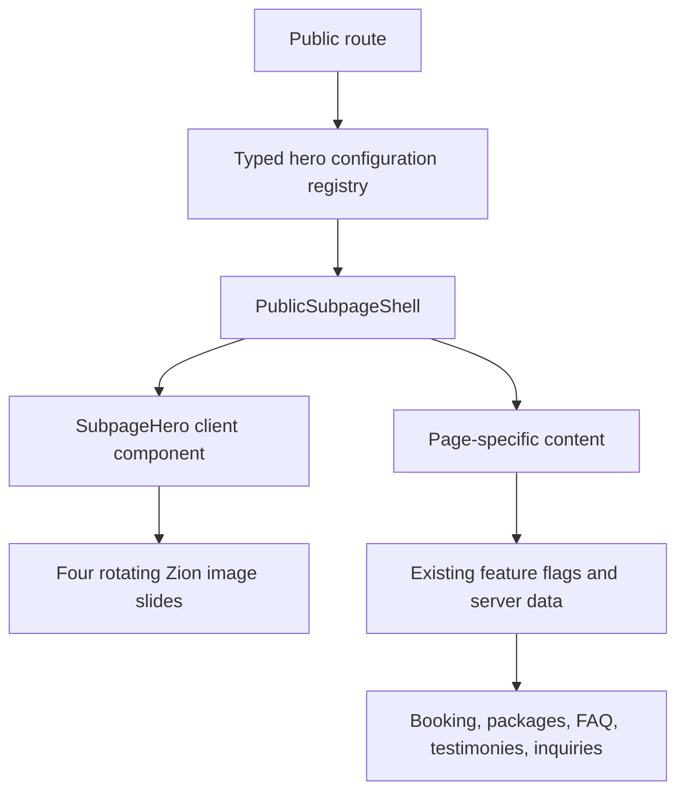

# Public Subpage Rotating Hero Architecture Plan
## Zion Events Place and Management System

---

## 1. Purpose

This plan defines how every public page accessible from the hamburger menu, except the Home page, will use the same hero format currently shown on the Book Now page.

The reference format is the current Book Now hero:

- Full-width hero occupying 65% of the viewport, with a 500-pixel minimum height
- Four rotating image slides
- Ten seconds of display time per slide
- One-second image and text crossfade
- Dark overlay for readable white text
- Zion logo and hamburger navigation layered above the hero
- Responsive title and subtitle typography
- Gold-and-white progress indicators at the bottom
- The page-specific content beginning directly below the hero

The shared format applies to the hero and page chrome. Each page keeps the content and behavior required for its purpose. For example, Gallery keeps its filters, Contact Us keeps its inquiry form, Testimonies keeps its availability controls, and Book Now keeps its booking flow.

---

## 2. Scope

### Included routes

| Hamburger destination | Route | Current status | Required result |
|---|---|---|---|
| Packages - Weddings | `/events/weddings` | Existing, static hero | Four-slide Book Now-format hero |
| Packages - Debuts | `/events/debuts` | Existing, static hero | Four-slide Book Now-format hero |
| Packages - Christening | `/events/christening` | Existing, static hero | Four-slide Book Now-format hero |
| Packages - Birthdays | `/events/birthdays` | Existing, static hero | Four-slide Book Now-format hero |
| Packages - Gender Reveal | `/events/gender-reveal` | Existing, static hero | Four-slide Book Now-format hero |
| Packages - Christmas Party | `/events/christmas-party` | Existing, static hero | Four-slide Book Now-format hero |
| Gallery | `/gallery` | Existing, static hero | Four-slide Book Now-format hero |
| About Us | `/about` | Existing, static hero | Four-slide Book Now-format hero |
| Facilities | `/facilities` | Menu link exists; route is missing | Create page and four-slide hero |
| Testimonies | `/testimonies` | Existing, static hero | Four-slide Book Now-format hero |
| Contact Us | `/contact` | Existing, static hero | Four-slide Book Now-format hero |
| FAQ | `/faq` | Existing, static hero | Four-slide Book Now-format hero |
| Rules & Regulation | `/rules` | Existing, static hero | Four-slide Book Now-format hero |
| Book Now | `/book` | Existing reference implementation | Refactor to consume the same shared configuration |

### Excluded routes

- `/` Home page, as explicitly requested
- Admin routes
- Authentication and account-recovery routes
- Booking receipt pages
- API routes
- Privacy Policy and Terms of Service, because they are footer/legal destinations rather than hamburger-menu pages

The legal pages may adopt the shell in a later phase, but they are not part of this change.

---

## 3. Current-State Findings

1. `components/client/SubpageHero.tsx` already implements the desired rotation behavior and is the correct visual foundation.
2. `app/book/components/BookFlow.tsx` contains the reference four-slide data twice: once for booking steps 1-9 and again for step 11.
3. Most included pages already render `SubpageHero`, but pass only `title`, `subtitle`, and one `imageSrc`, so no rotation occurs.
4. All six event pages use `components/booking/PackageLayout.tsx`, which currently accepts only one `heroImage`.
5. `/facilities` appears in `components/layout/Navbar.tsx`, but no `app/facilities/page.tsx` route exists.
6. Package content is partially split between hard-coded public pages and the database-driven Services & Packages module. The public APIs correctly enforce active and client-visible status.
7. Booking, packages, FAQ, testimonies, testimony submissions, inquiries, and the assistant are controlled by system settings. The hero redesign must not bypass those controls.
8. Several pages use remote Unsplash images while the repository already contains Zion-owned event imagery under `public/zion`. Depending on remote images for the first viewport makes appearance and availability less predictable.

---

## 4. Architecture Decision

Use one shared hero component, one shared page shell, and one typed route configuration registry.



This separates three responsibilities:

| Layer | Responsibility |
|---|---|
| Hero configuration | Which slides, titles, subtitles, and images belong to each route |
| Shared shell | Identical page frame, hero placement, spacing, background transition, and content slot |
| Page content | Page-specific business function, data fetching, forms, filters, feature flags, and empty states |

### Why this structure

- A visual change is made once and reaches all included pages.
- Each route can tell its own story without changing the common layout.
- Existing server-rendered pages remain server components.
- Only the rotating hero requires client-side state and effects.
- Package and booking availability remain authoritative and separate from presentation.
- The Home page can keep its current special layout.

---

## 5. Proposed File Structure

```text
components/
  client/
    SubpageHero.tsx                 # Existing carousel, hardened and made configurable
    PublicSubpageShell.tsx          # Shared hero + page-content frame

config/
  public-page-heroes.ts             # Typed slide registry for static public routes

app/
  book/
    page.tsx
    components/BookFlow.tsx
  events/
    weddings/page.tsx
    debuts/page.tsx
    christening/page.tsx
    birthdays/page.tsx
    gender-reveal/page.tsx
    christmas-party/page.tsx
  gallery/page.tsx
  about/page.tsx
  facilities/page.tsx               # New route required by existing navigation
  testimonies/page.tsx
  contact/page.tsx
  faq/page.tsx
  rules/page.tsx

components/
  booking/
    PackageLayout.tsx               # Receives hero slides instead of one hero image
```

`config/public-page-heroes.ts` must contain serializable data only. It must not import database clients, browser APIs, or server secrets, so it can safely pass data from server pages to the client hero.

---

## 6. Shared Contracts

The existing `SlideData` contract should become the single source of truth and include accessible image text.

```ts
type HeroSlide = {
  title: string;
  subtitle: string;
  imageSrc: string;
  imageAlt: string;
};

type PublicPageHeroConfig = {
  routeKey: PublicPageRouteKey;
  slides: readonly [HeroSlide, HeroSlide, HeroSlide, HeroSlide];
};
```

The tuple enforces exactly four slides for every included page. The hero should also accept optional behavior settings with shared defaults:

```ts
type HeroBehavior = {
  rotationMs?: number;      // default: 10000
  transitionMs?: number;    // default: 1000
  pauseOnHover?: boolean;   // default: true
};
```

Per-page code should normally supply only the route key or the four-slide array. It should not redefine height, overlay opacity, fonts, indicators, or timing.

---

## 7. Canonical Visual Contract

All included pages must inherit the following values from the shared implementation:

| Element | Canonical rule |
|---|---|
| Hero height | `65vh`, minimum `500px` |
| Width | Full viewport width |
| Image fit | Cover and center |
| Image treatment | 20% grayscale, one-second opacity crossfade |
| Overlay | 50% black |
| Title | White, centered, Segoe display face, responsive 40/56/72 px scale |
| Subtitle | White, centered, serif, responsive 18/22/24 px scale |
| Content width | Title maximum 5xl; subtitle maximum 3xl |
| Header offset | Existing top padding retained for fixed logo/navigation |
| Indicators | Active gold 32-pixel bar; inactive translucent white dots |
| Slide count | Exactly four |
| Rotation | Ten seconds per slide |
| Transition | One second |
| Content start | Immediately below the hero through the shared shell |

Page files must not override these rules. If the design changes later, it changes in the shared hero only.

---

## 8. Route Content Strategy

Each route receives four slides with page-specific copy and images while retaining the same design.

| Route group | Slide story sequence |
|---|---|
| Book Now | Plan the vision -> discover the venue -> trust the team -> celebrate the milestone |
| Weddings | Ceremony -> reception -> couple experience -> lasting memories |
| Debuts | Grand entrance -> elegant styling -> celebration program -> milestone portrait |
| Christening | Family blessing -> gentle styling -> welcoming space -> family memories |
| Birthdays | Theme -> gathering -> entertainment -> milestone memory |
| Gender Reveal | Anticipation -> reveal moment -> family celebration -> joyful details |
| Christmas Party | Seasonal styling -> shared meal -> team/family gathering -> festive memory |
| Gallery | Weddings -> milestones -> venue spaces -> event details |
| About Us | Zion story -> founders/team -> service promise -> venue legacy |
| Facilities | Glass Hall -> Pavilion Garden -> Pool -> venue amenities/accessibility |
| Testimonies | Real celebrations -> client trust -> service quality -> invitation to share feedback |
| Contact Us | Inquiry -> site visit -> planning support -> booking next step |
| FAQ | Planning questions -> venue logistics -> packages/payments -> event-day guidance |
| Rules | Venue care -> setup rules -> safety/capacity -> respectful event closeout |

### Image sourcing rules

1. Prefer approved Zion-owned local files in `public/zion`.
2. Use meaningful `imageAlt` text for every slide.
3. Do not use generic placeholders or lorem ipsum in final client-facing copy.
4. Do not reuse the same four photos on every route; the format is shared, but the story must remain relevant.
5. Ensure each photo remains readable under the canonical center crop at desktop, tablet, and mobile sizes.
6. Remote images are allowed only when approved and configured through precise `images.remotePatterns` if rendered with `next/image`.

---

## 9. Page Integration Plan

### 9.1 Book Now

- Move the duplicated Book Now slide array from `BookFlow.tsx` into the central registry.
- Render the shared shell at the page boundary so the hero is not duplicated across booking step branches.
- Keep the rotating hero visible for steps 1-9 and the result step if this is the accepted current behavior.
- Keep the special generating step focused and avoid unexpectedly restarting the carousel during step transitions.
- Preserve `bookingRequests` availability checks and the existing disabled message.
- Preserve all form state, validation, progress stations, cancellation, review, and result behavior.

### 9.2 Package pages

- Change `PackageLayout` from `heroImage: string` to `heroSlides: HeroSlide[]` or a typed route key.
- Keep the package feature availability check below the shared hero.
- Preserve content blocks, spaces, package details, flipbook, gallery, and reserve CTA.
- Continue enforcing category and package status rules: only `ACTIVE` and `clientVisible` records are bookable or client-facing.
- Do not allow the visual hero registry to become an alternate source for pricing, inclusions, payment rules, or availability.
- As a follow-up modernization, public event pages may load the category cover and package content from the current client APIs, with local hero fallbacks when no approved media exists.

### 9.3 Gallery

- Wrap the existing page content in the shared shell.
- Retain category filters, image grouping, hover behavior, and gallery semantics.
- Replace the page-specific solid background override with the shared background/content transition unless design review identifies a deliberate exception.

### 9.4 About Us

- Keep the story, statistics, advantages, founders, testimonials, and CTA.
- Avoid competing motion in the first viewport; the secondary `ImageSlideshow` remains lower on the page.
- Use Zion story and venue images rather than generic event imagery.

### 9.5 Facilities

- Create `app/facilities/page.tsx` so the existing hamburger link resolves.
- Use the shared four-slide hero.
- Initial content should document the Glass Hall, Pavilion Garden, Pool, capacity/amenities, accessibility, parking, and site-visit CTA.
- Reuse existing venue assets where appropriate, but keep the content modular for later database management.
- If facility facts such as capacity are not verified, show no number rather than inventing one.

### 9.6 Testimonies

- Preserve `publicTestimonies` and `testimonySubmissions` feature settings.
- Keep approved/visible testimony loading and submission behavior unchanged.
- The hero must not display unpublished client photos or text.

### 9.7 Contact Us

- Preserve inquiry validation, submission APIs, support preview, address, phone, email, social links, and map/location content.
- Respect `inquirySubmissionsEnabled`; a disabled form must continue to show the configured system message.
- Keep hero copy action-oriented but do not claim a date is secured before the booking workflow confirms availability.

### 9.8 FAQ

- Preserve `faqVisible`, published FAQ filtering, categories, search/accordion behavior, and smart-assistant integration.
- Slides may summarize FAQ topics but must not duplicate answers that are managed from the support module.

### 9.9 Rules & Regulation

- Replace placeholder lorem ipsum with approved operational rules before release.
- Keep rules content easy to scan below the shared hero.
- Version or date the rules if they become contractually significant.
- Avoid presenting draft rules as finalized policies.

---

## 10. System Alignment and Status Preservation

The visual unification must not change the authority of existing modules.

| System concern | Source of truth | Required protection |
|---|---|---|
| Booking availability | System settings and booking validation | Hero CTA never bypasses disabled state or calendar checks |
| Package visibility | Event category/package status and `clientVisible` | Hidden or archived offers never appear because of hero configuration |
| Package price/inclusions | Services & Packages database records | No price or inclusion data stored in hero copy |
| Testimony visibility | Testimony moderation and client settings | Only approved public content may appear |
| Inquiry availability | System settings and inquiry API | Contact design does not imply successful submission when disabled |
| FAQ visibility | Support Center publication state and settings | Hero remains decorative/navigation context, not an alternate FAQ store |
| Maintenance mode | Public system settings | Existing maintenance behavior remains authoritative |
| Audit and notifications | Existing admin service layer | No change to operational logging from a presentation refactor |

The shared hero is a presentation layer. It must never decide whether a booking, package, testimony, inquiry, or FAQ is operationally available.

---

## 11. Interaction, Accessibility, and Performance

### Interaction

- Auto-rotate only when more than one valid slide exists.
- Pause rotation while the user hovers over the hero or the browser tab is hidden.
- Preserve the active slide during ordinary rerenders; do not recreate the slides array inside render paths.
- Add clickable indicators only if they include buttons, focus styles, and accessible labels.
- Reset to slide one on route change.

### Accessibility

- Honor `prefers-reduced-motion`: show the first slide without automatic crossfade, or use an immediate low-motion change.
- Hero text must remain actual text, not embedded in images.
- Maintain WCAG AA contrast over every selected image.
- Provide descriptive alt text when using semantic images. If implemented as CSS backgrounds, expose an equivalent accessible label or treat the imagery as decorative and ensure all meaning is in the title/subtitle.
- Indicators must not be the only way the current slide is communicated.
- Ensure fixed logo and menu remain keyboard accessible above the hero.

### Performance

- Use local optimized assets wherever possible.
- Load the first hero image eagerly/high priority; defer later slides.
- Use `next/image` with `fill`, `sizes`, and stable parent dimensions when practical.
- Avoid loading all full-resolution source photos on mobile.
- Keep only the hero as a client component; pages and data loading remain server-rendered unless they already require interactivity.
- Prevent cumulative layout shift by retaining a fixed hero height contract.

---

## 12. Error and Fallback Behavior

The shared hero must fail gracefully.

1. If one slide image fails, skip to the next valid slide without removing the hero container.
2. If fewer than four configured images are available during development, fail a configuration test rather than shipping an incomplete rotation.
3. If runtime database media is added later and is unavailable, use the local route fallback.
4. If JavaScript is disabled, the server-rendered first slide remains visible.
5. A page feature being disabled affects the content panel, not the visual stability of the shared page shell.

---

## 13. Implementation Phases

### Phase 1 - Shared foundation

1. Extend and harden `SlideData`.
2. Create the typed hero configuration registry.
3. Create `PublicSubpageShell`.
4. Move Book Now slides into the registry and remove duplication.
5. Add reduced-motion, visibility pause, hover pause, and accessible indicator behavior.

### Phase 2 - Package routes

1. Update `PackageLayout` to accept the shared hero contract.
2. Add four relevant slides to all six package pages.
3. Verify package feature flags and client visibility remain unchanged.
4. Replace remaining client-facing placeholder copy before release.

### Phase 3 - Information and engagement routes

1. Migrate Gallery, About Us, Testimonies, Contact Us, FAQ, and Rules.
2. Create the missing Facilities page.
3. Verify each page retains its current function and data source.

### Phase 4 - Quality and launch

1. Run lint and TypeScript checks.
2. Test all routes at mobile, tablet, laptop, and wide desktop sizes.
3. Test keyboard navigation and reduced motion.
4. Test feature-disabled states.
5. Review image crops and copy with the Zion content owner.
6. Measure first-viewport performance before and after migration.

---

## 14. Verification Matrix

Every included route must pass the following checks:

| Check | Expected result |
|---|---|
| Initial render | First image and text are visible with no layout jump |
| Rotation | Changes every 10 seconds |
| Crossfade | One-second smooth transition with no white flash |
| Sequence | Slide 4 returns to slide 1 |
| Indicators | Active state follows the visible slide |
| Header layering | Logo and hamburger remain visible and clickable |
| Mobile crop | Subject remains understandable at narrow widths |
| Reduced motion | No forced automatic animation |
| Feature disabled | Correct configured unavailable state still renders |
| Navigation | All menu destinations resolve; `/facilities` no longer returns 404 |
| Page function | Forms, filters, accordions, booking steps, and package actions still work |
| Content status | Hidden, archived, draft, or unapproved data remains hidden |

Recommended automated coverage:

- Unit test for route registry completeness and exactly four slides per included route
- Component test for timer cleanup and rotation loop
- Component test for reduced-motion behavior
- Route smoke test for all hamburger destinations
- Integration tests for feature-disabled Book, Packages, Testimonies, Contact, and FAQ states
- Visual regression snapshots at 390x844, 768x1024, 1440x900, and 1920x1080

---

## 15. Definition of Done

The work is complete only when:

1. Every hamburger-menu page except Home uses the same Book Now hero height, overlay, typography, timing, transition, and indicators.
2. Every included page has exactly four relevant slides.
3. Book Now consumes the same shared system and no longer duplicates its slide configuration.
4. All six package pages use the shared rotating hero through `PackageLayout`.
5. `/facilities` exists and is reachable from the hamburger menu.
6. Existing business behavior and system feature settings remain unchanged.
7. No hidden, archived, draft, or unapproved operational content is exposed.
8. Client-facing lorem ipsum is removed from package and rules pages before production sign-off.
9. The experience is responsive, keyboard accessible, reduced-motion friendly, and visually verified.
10. Lint, typecheck, route smoke tests, and agreed visual regression checks pass.

---

## 16. Recommended Delivery Boundary

Implement the shared hero migration as one focused client-facing presentation change. Do not combine it with a full Services & Packages data migration, a content-management redesign, or a booking workflow rewrite.

Those systems already contain important status, visibility, audit, payment, and booking rules. Keeping this delivery boundary narrow makes it possible to prove that the new shared visual format improves consistency without changing operational behavior.
